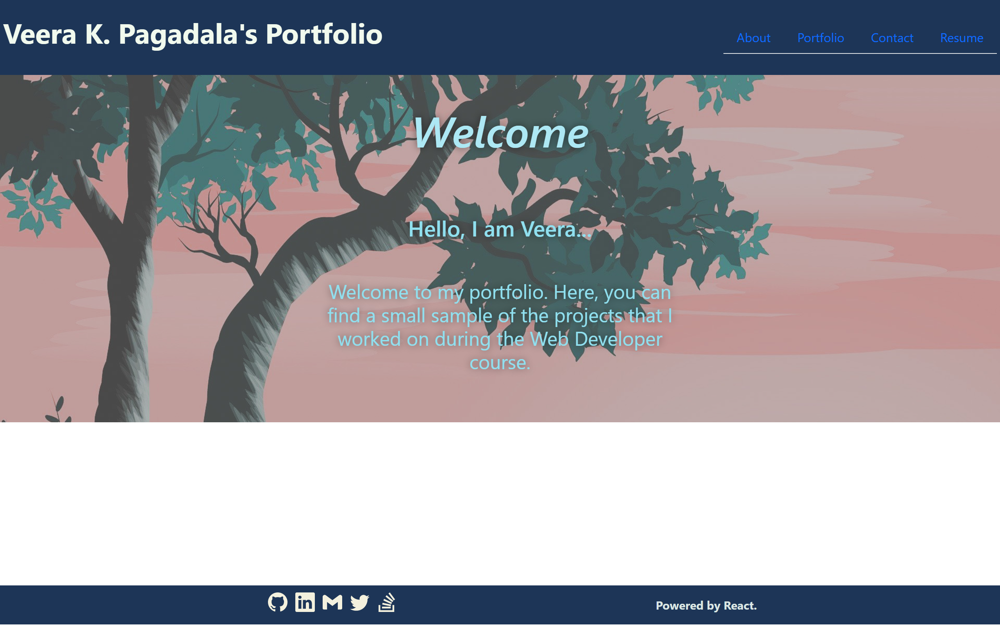

# Project Title: 20-React-Portfolio

## Description:
 This project presents my portfolio, resume and contact options. These pages are developed using React technology, which is aptly acknowledged.

## Installation:
 - `npm i` is used for all the required packages.
 - `npm i gh-pages` package is used to deploy the application.
 - `npm start` is used to run the application.
 - `npm run deploy` is used to deploy the application.

## Usage:

The project presents my portfolio as a single-page application. The portfolio loads with a page containing a header, a section for content, and a footer. The header presents my (the developer's) name. The navigation bar  presents different section titles withing the portfolio, such as 'About', 'Portfolio', 'Contact', and 'Resume'. The title corresponding to the current section is highlighted. 
Upon clicking any navigation title, the corresponding section is displayed below the navigation bar (without reloading the page) and its title gets highlighted. 
- The 'About Me' section presents my recent photo and a short biography. 
- The Portfolio section presents titles and thumbnails of the applications I developed. The link to each deployed applications is provided in the thumbnail and the corresponding GitHub repository is provided in the GitHub logo. 
- The Contact section present an online form with fields for a name, an email address, and a message. The user is notified for invalid entries. For example, when a user enters a text into the email address field, they will receive a notification if they enter an invalid email addres. 
- The Resume section presents a link to a downloadable resume and a list of the developer’s proficiencies. 
- The footer presents icon links to the developer’s GitHub, LinkedIn, Twitter and Stack Overflow profiles and email. The footer also includes an acknowledgement for React application. 

  ### The gh-pages deployed application is:
     
     https://veerak21.github.io/20-React-Portfolio/

   

   The following screenshots demonstrate the website application.

   

   

   

   

   

  
## Questions?
  ### Reach me here: 
   My GitHub profile:   [veerak21](https://github.com/veerak21),

   My E-mail: pv.kallu@gmail.com. 

  